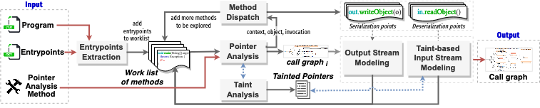

# SENECA: Taint-Based Call Graph Construction for Java Object Deserialization

This repository contains the source code for `Seneca`, a taint-based call graph construction for Java programs. This tool is part of the following paper:

```
Santos, J.C.S., Mirakhorli, M. & Shokri, Ali. "Seneca: Taint-Based Call Graph Construction for Java Object Deserialization."
OOPSLA (2024). https://doi.org/10.1145/nnnnnnn.nnnnnnn
```


As shown in the figure below, to support serialization-related features, `Seneca` employs an on-the-fly iterative call graph construction technique that involves two major phases: 

**(1)** Iterating over a worklist of methods to create the initial call graph using an underlying pointer analysis method; 

**(2)** Refinement of the initial call graph by making a set of assumptions performed iteratively until a fixpoint is reached (i.e., when there are no more methods left in the worklist to
be visited).




The technical details of how the approach perform these two phases is described in the **Section 3** of the paper.

## Artifact Details
Since the artifact is too big to be attached (>22Gb), it is  available to be downloaded from Zenodo and GitHub:


- Zenodo URL: https://dx.doi.org/10.5281/zenodo.10464129
- GitHub URL: https://github.com/s2e-lab/seneca 

Please notice that since GitHub has repository size limitation, several compiled files were added to gitignore. Thus, instead of cloning the repository, it is better to download the zip file from Zenodo which will have all the results already and the tool already compiled into JAR files. Please refer to the README.md file on the root folder of the artifact.


## Repository Structure

This repository has two folders:

- `paper-scripts`: scripts used to compute the results shown in the paper (**Section 5**).
- `seneca-src`: the actual source code for seneca (technical details described in **Section 3**).


## Using Seneca (`seneca-src`)


### Requirements
- Java 8 (and above)
- Maven (3.8+) 

The code was tested with Java 11 and Maven 3.8.7 on macOS Monterey with 32 GB  of memory.


### Running Seneca using Java directly (through its Command Line Interface)

The code has been compiled using Java 11 with all of its dependencies and it is located on this artifact's root folder (file: `seneca.jar`).

`Seneca` has a command line interface that can be used as follows:

```
java -jar seneca.jar <parameters>
```

**Required Parameters:**

```
 -f,--format <arg>          Output format (possible values: dot, jdyn). JDyn is a custom format that saves the call graph as tuples (caller, callee)
 -j,--jar <arg>             Path to the project's JAR file 
 -o,--output <arg>          Path to the output file with the serialized call graph
 -pta,--main-policy <arg>   Pointer analysis choice (n-CFA, 0-n-CFA)
```

**Optional Parameters:**

```
 -e,--exclusions <arg>      Path to an exclusions file
    --view-ui               Shows call graph in a Java Swing UI
    --print-models          Prints to the console all the synthetic methods created
```


***Sample Usage using the provided compiled JAR:***

The command below will generate a call graph for the program example in the paper (**Listing 3**) using `0-1-CFA` as the pointer analysis policy. The call graph is serialized into the DOT format saved on the file `OOPSLAPaperExample.dot` and it will also open a Window with the call graph.

```bash
java -jar seneca.jar \
		-j paper-scripts/dataset/sample-programs/OOPSLAPaperExample-JRE1.7.jar \
		-f dot \
		-o OOPSLAPaperExample.dot \
		-pta 0-1-CFA \
		--view-ui
```


### Running Seneca using Docker

1. Build the docker image

	```
	docker build -t seneca .
	```

2. Run it using:

	```
	docker run -it --rm seneca <parameters>
	```


***Sample Usage using the Dockerfile***


```bash
docker run -it --rm seneca -j /usr/src/seneca/paper-scripts/dataset/sample-programs/OOPSLAPaperExample-JRE1.7.jar -f dot -o OOPSLAPaperExample.dot -pta 0-1-CFA 
```

## Reusing Seneca on your project

Seneca is built using WALA and maven. If you'd like to use Seneca programmatically you can do so by:

1. Importing Seneca as Maven dependency

	```xml
	<dependency>
		<groupId>edu.rit.se.design</groupId>
		<artifactId>seneca</artifactId>
		<version>1.0</version>
	</dependency>
	```

2. Making sure to install seneca to your local maven (by running `mvn install`)
		
3. You can now use the static methods from the class `edu.rit.se.design.callgraph.cli.Seneca` to get an instance of a `CallGraphBuilder` (which has the points to sets) and the `CallGraph`. The call graphs generated by Seneca follow the interfaces provided by WALA.

	**Sample API usage code:**
	
	```java
	String jarFilePath = "...path to your program JAR...";
	File exclusions = File("/path/to/your/exclusions.txt"); 
	PointerAnalysisPolicy primaryPaPolicy = /* ... */;
	PointerAnalysisPolicy secondaryPaPolicy = new PointerAnalysisPolicy(PointerAnalysisPolicy.PolicyType.nCFA, 1);
	
	Pair<CallGraph, CallGraphBuilder> results = computeCallGraph(jarFilePath, exclusions , primaryPaPolicy, secondaryPaPolicy, null);
	
	CallGraph cg = results.getLeft();
	CallGraphBuilder builder = results.getRight();
	
	// rest of code, you can use the data structures above for your downstream analyses
	```


## Results Folder

All the results presented in **Section 5** are located in the folder `paper-scripts`.
The [README.md](paper-scripts/README.md) in that folder contains a detailed description of each file and how they related to the results for each research question.

